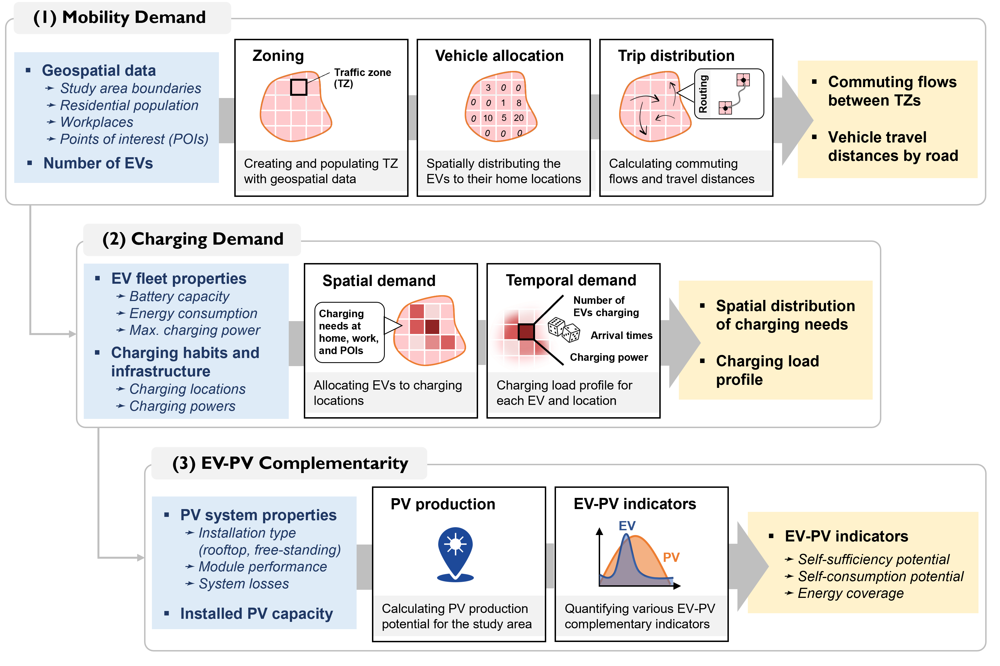

# 🚗 EVPV-simulator

## 📚 Documentation et Matériel de Formation

Le **EVPV-simulator** (simulateur Véhicules Électriques – Photovoltaïque) est un outil open-source en Python développé au laboratoire PV-LAB de l’EPFL pour simuler les besoins de recharge spatiaux et temporels des véhicules électriques (EV) privés et les associer à la production locale d’électricité solaire photovoltaïque (PV). Conçu pour les environnements urbains avec peu de données de mobilité, il combine des données géoréférencées avec des modèles de distribution spatiale des trajets et utilise [PVLib](https://pvlib-python.readthedocs.io/en/stable/) pour la modélisation de la production solaire.

- 📖 [**Documentation complète**](https://evpv-simulator.readthedocs.io/en/latest/) : guide utilisateur, documentation API et flux de travail
- 💻 [**GitHub projet**](https://github.com/evpv-simulator) : accès au code source et aux exemples
- 🐍 Langage : Python 3.12

---

## 🧠 Vue d’ensemble du Modèle

Le simulateur EVPV fournit trois sorties de simulation principales :

1. **Estimation de la demande de mobilité** – À l’aide de la densité de population, des lieux de travail et des POI (points d’intérêt), la ville est divisée en zones de trafic et les trajets domicile-travail sont simulés.
2. **Calcul de la demande de recharge** – Basé sur les paramètres du véhicule, la logique de l’état de charge (SoC) et les habitudes de recharge définies par l’utilisateur (domicile, travail, POI), le modèle estime les besoins de recharge par zone et par heure.
3. **Complémentarité EV–PV** – Calcule la production PV horaire avec PVLib et évalue l’autoconsommation et l’autosuffisance selon la correspondance spatio-temporelle avec la recharge des VE.


<p><font size="-1">🔁 Vue d’ensemble d’EVPV-simulator – Tous les intrants/sorties ne sont pas affichés.</font></p>

---

## ⚙️ Installation

### 🐍 Configuration de Python

Nous recommandons d’utiliser **Miniconda** :
- Installez [Miniconda](https://docs.conda.io/en/latest/miniconda.html) et créez un environnement virtuel :

```bash
conda create --name evpv-env python=3.12
conda activate evpv-env
```

### 📦 Installer EVPV-simulator

```bash
pip install git+https://github.com/evpv-simulator/evpv.git
```

---

## ▶️ Comment Exécuter EVPV-simulator

### 🔹 Étape 1 : Préparez votre fichier de configuration
- Copiez et adaptez l’exemple d’Addis-Abeba : [exemple Addis Abeba](https://github.com/evpv-simulator/evpv-examples)
- Assurez-vous que les données géospatiales sont prêtes : frontières régionales, raster de population, liste des lieux de travail, POI

### 🔹 Étape 2 : Lancez le modèle en ligne de commande
```bash
evpv
```
Puis entrez le chemin vers votre fichier de configuration lorsqu’il est demandé.

### ⚠️ Remarques :
- Utilisez des **chemins absolus** ou ouvrez le terminal dans le dossier contenant le fichier de configuration
- Recommandé : commencez par l’exemple d’Addis-Abeba pour vous familiariser avec les sorties

---

## 🗂️ Données d’entrée requises

- **Frontière régionale** : fichier GeoJSON provenant de sources comme [GADM](https://gadm.org)
- **Densité de population** : raster issu de [GHS-POP](https://human-settlement.emergency.copernicus.eu)
- **Lieux de travail & POI** : fichier CSV avec latitude/longitude et pondérations. Peut être généré automatiquement via un script OSM.

---

## 📤 Structure des sorties

| Dossier               | Description du contenu                                        |
|----------------------|---------------------------------------------------------------|
| `Mobility/`          | Flux, distances et cartes interactives pour la modélisation   |
| `ChargingDemand/`    | Puissance de recharge par heure et localisation, avec cartes HTML |
| `EVPV/`              | Production PV et indicateurs de correspondance avec la recharge |

---

## 🧪 Utilisation Avancée

Importer les modules EVPV dans vos propres scripts :
```python
from evpv.vehicle import Vehicle
from evpv.vehiclefleet import VehicleFleet
```
Toutes les classes sont dans le répertoire `evpv/`, telles que `region.py`, `pvsimulator.py`, etc.

---

## ⭐ Fonctionnalités et Limitations

### ✅ Fonctionnalités principales
- Modèle de demande de mobilité basé sur la gravité, sans calibration ([Lenormand et al. 2015](https://doi.org/10.1016/j.jtrangeo.2015.12.008))
- Simulation de recharge basée sur l’état de charge ([Pareschi et al. 2020](https://doi.org/10.1016/j.apenergy.2020.115318))
- Prêt pour la recharge intelligente : règle simple de lissage des pics disponible
- Indicateurs de synergie EV–PV : autoconsommation et autosuffisance

### ❌ Limitations
- Jours de semaine uniquement (pas de comportement week-end)
- Pas d’arrêts intermédiaires ni de trajets multi-usages
- Validation limitée pour les zones de trafic inférieures à 5 km²
- Les API PVGIS et OpenRouteService nécessitent une connexion Internet
- Suppose un système énergétique fermé (le PV alimente uniquement les EV)

---

## 📄 Publication Scientifique

📘 Dumoulin et al. (2025). *A modeling framework to support the electrification of private transport in African cities: a case study of Addis Ababa*. arXiv:2503.03671. [Lien](https://doi.org/10.48550/arXiv.2503.03671)

---

## 🎥 Support Vidéo Pas-à-pas

Vous pouvez consulter tous les tutoriels sur  
<a href="https://www.youtube.com/playlist?list=PLHN93NPePQ1JPEb3YFsYi3TU__bb_Xcyx" target="_blank" style="text-decoration: none;">
  
</a>

---

## ❓ Besoin d’aide ?

Consultez notre page [Questions & Réponses](docs/faq.md) pour des problèmes fréquents et des conseils.

---

## 📜 Licence

Distribué sous licence [GNU GPLv3](https://www.gnu.org/licenses/gpl-3.0.html).  
Développé initialement au laboratoire PV-LAB de l’EPFL (Suisse). Auteurs : Jérémy Dumoulin, Alejandro Peña-Bello, Noémie Jeannin, Nicolas Wyrsch.  
Actuellement maintenu par le [African Energy Modelling Network](https://africanenergymodellingnetwork.net/en/home).
